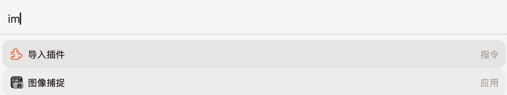
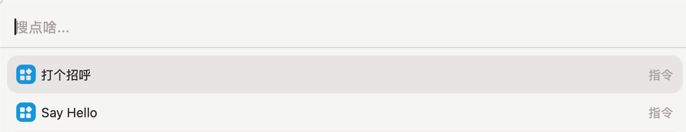
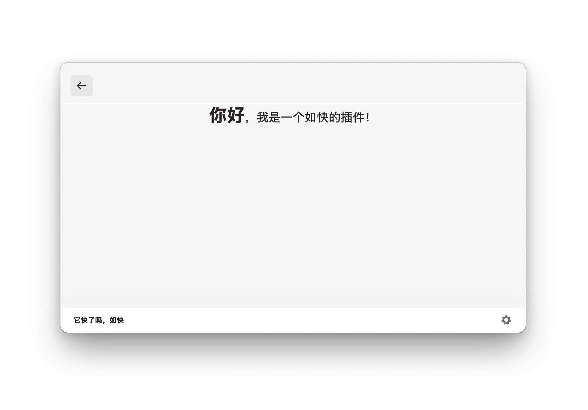

# Sofast Extension Template

Sofast插件开发模板。

## 示例插件 Greet

1. 新增一个Vue组件，作为插件的主页即 [Greet.vue](./src/components/Greet.vue)
    ```html
    <div class="w-full h-full grid place-items-center">
      <span class="text-stone-800">
        <span class="text-3xl font-bold">你好</span>，我是一个如快的插件！
      </span>
    </div> 
   ```
1. 在 `Sofast` 的插件系统中，一个 Vue 组件被视为一个 `Command`，它的入口文件的固定写法为导出一个 `() => App` 格式的函数
    ```typescript
    import Greet from "./components/Greet.vue";
    import './assets/index.css' // 这里导入一下 TailwindCSS 的 base.css 文件，不使用 TailwindCSS 请忽略，当然，这里建议使用 TailwindCSS 或者 Unocss 来提高开发效率
    import {createApp} from "vue";
    
    export default () => createApp(Greet)
    ```

1. 配置 `package.json` 文件，`Sofast` 需要用到的字段有：
   ```json
   {
     "title": "Sofast Extension Template",
     "author": "Blushyes",
     "commands": [
       {
         "name": "greet",
         "title": "打个招呼"
       },
       {
         "name": "sayHello",
         "title": "Say Hello"
       }
     ],
     "description": "A template for creating a Sofast extension",
     "categroies": [
       "template"
     ]
   }
   ```
   其中，`command` 是最终要的字段，声明了你这个插件需要注册的所有指令，`name` 字段为这个指令在 `src` 目录下对应的文件名，比如 `name` 为 `sayHello` 时，指令对应的文件为 `src/sayHello.ts`
   
   其他字段说明待完善

1. 接下来运行 `npm run build` 构建项目

1. 得到的 `dist` 文件夹即为我们的插件文件夹（现在还不支持导入压缩包插件）

1. 接下来，进入 `Sofast` 中导入插件（注意，`导入插件`是开发者模式，正式加载插件是`添加插件`）即可

   

   可以看到已经有了
   

   现在打开看看
   
   
